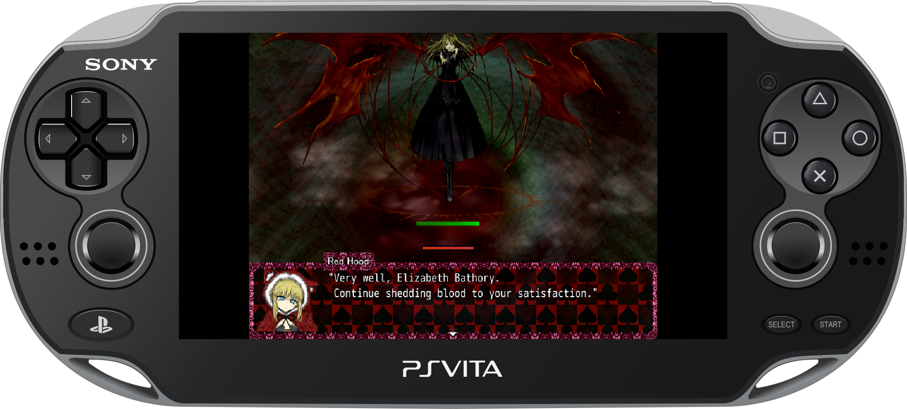
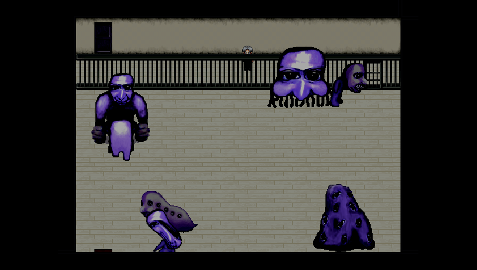
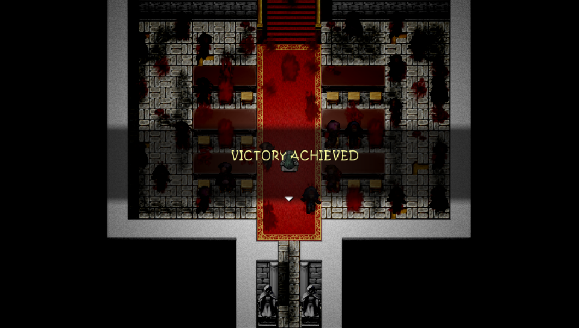
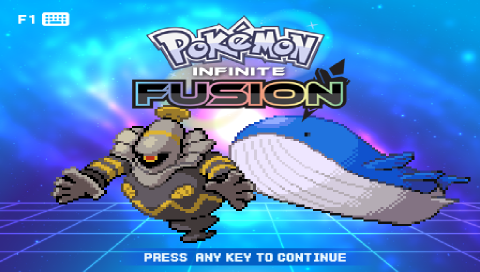
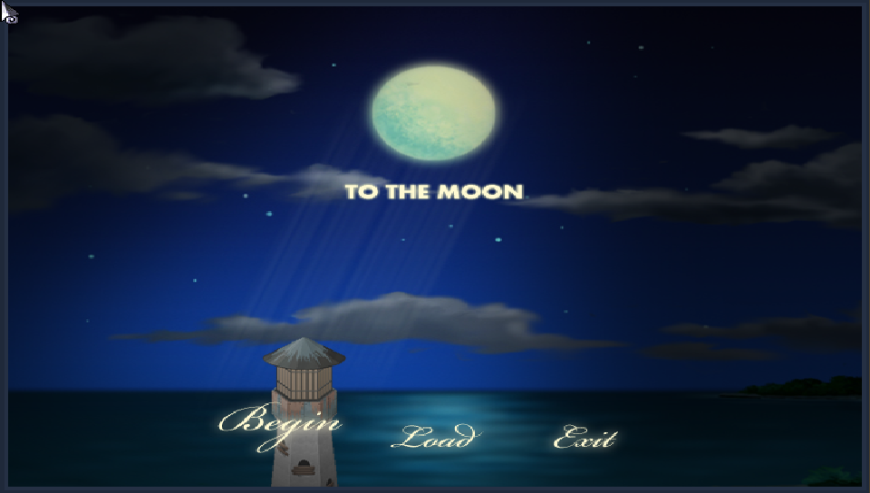
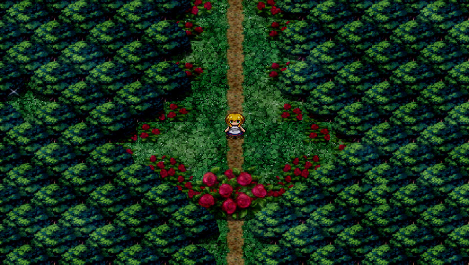
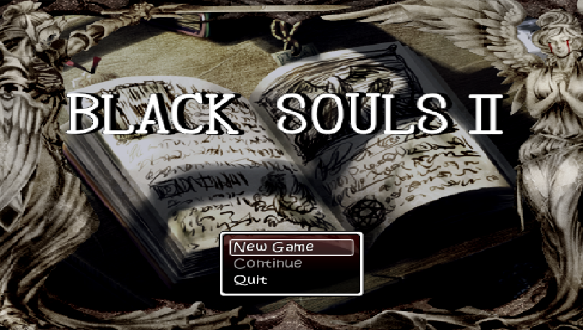

# mkxp-z-vita · HardRPG

<p align="center">
  
</p>

<p align="center"><b>A native RPG Maker launcher for PlayStation Vita</b><br>XP · VX · VX Ace · Your games, running on the device</p>

<p align="center">
  
  <a href="#status"></a>
  <a href="docs/COMPATIBILITY.md"></a>
</p>

<p align="center"><a href="#installation">Install</a> · <a href="#adding-games">Add games</a> · <a href="#controls">Controls</a> · <a href="docs/COMPATIBILITY.md">Compatibility</a> · <a href="#screenshots">Screenshots</a> · <a href="#building">Build</a> · <a href="#credits-and-licenses">Credits</a></p>

mkxp-z-vita is a native PlayStation Vita port of mkxp-z for RPG Maker XP, VX
and VX Ace games. **HardRPG** is its included launcher: pick a game from your
library and play on the device. The engine can also be built without the
launcher for standalone game packages.

## Status

> [!NOTE]
> HardRPG 0.1 Alpha is an early release. Compatibility varies by game; check the
> [game-by-game results](docs/COMPATIBILITY.md) before playing.

The **0.1 Alpha release VPK** has been tested on a real PS Vita.
Launching a title does not mean the full game is playable.
Download **0.1 Alpha** from [Releases](https://github.com/Asukate/mkxp-z-vita/releases).

## Installation

> [!IMPORTANT]
> Games and RPG Maker RTP are not included. Supply your own files.

You need a homebrew-enabled Vita with VitaShell.

1. Download **HardRPG.vpk** from [Releases](https://github.com/Asukate/mkxp-z-vita/releases).
2. Copy the VPK to your Vita and install it with VitaShell.
3. Open **HardRPG** once to create its folders, then add your games as described below.

<details>
<summary>If needed: shader compiler setup</summary>

HardRPG uses Sony's shader compiler, `libshacccg.suprx`. If it is missing from
`ur0:/data/`, [VitaDB Downloader](https://github.com/Rinnegatamante/VitaDB-Downloader#changelog)
can install it automatically. Alternatively, follow the
[shader compiler setup guide](https://github.com/Rinnegatamante/vitaGL#prerequisites).
This is a one-time console setup.

</details>

## Adding games

HardRPG creates `ux0:/data/hardrpg/` on first launch, including its games,
RTP, settings, and cache folders. Copy your game folders or ZIP archives into
`games/`. Keep each game's `Game.ini` and original file structure intact.

```text
ux0:/data/hardrpg/
├── games/
│   ├── My Game/
│   │   ├── Game.ini
│   │   ├── Data/        (or the game's RGSS archive)
│   │   ├── Graphics/
│   │   └── Audio/
│   └── Another Game.zip
└── rtp/
    ├── Standard/       RPG Maker XP RTP, if needed
    ├── RPGVX/          RPG Maker VX RTP, if needed
    └── RPGVXAce/       RPG Maker VX Ace RTP, if needed
```

You can also use games stored elsewhere. Press **Start** to open the folder
browser, use **Cross** to enter folders, and press **Square** to scan the
current game or collection folder. Recognized games are added to your library;
ordinary game folders stay in their original location. Press **Start** again
to close the browser. Available `ux0:`, `uma0:`, and `imc0:` storage can be browsed.

Use **Cross** to browse nested folders and ZIPs or start a recognized game.
**Triangle** refreshes the library after you copy files. ZIP games are unpacked
into a reusable cache on first launch, so leave room for their uncompressed
files. Their saves remain in that working copy; keep it when updating the app.

See [library, ZIP saves, and per-game settings](launcher/README.md) for details.

**Settings** lets you change game aspect ratio, scaling and filtering; choose
existing RTP folders or ZIPs; and add extra game folders to search automatically.
RTP status shows **Detected** or **Missing**. Selected RTP stays in its original
location, and RTP ZIPs are read directly without extracting another copy.

The ZIP-game working copy does not expire or get cleaned automatically. Saves
can live inside it, so back them up before deleting a game's cache folder.

## Controls

| In the launcher | Action |
| --- | --- |
| D-pad Up / Down | Move through menus and lists |
| Cross | Select a menu item, open a folder or ZIP, or launch a game |
| Circle | Go back or cancel |
| Triangle | Refresh the current listing |
| Start | Open or close the folder browser |
| Square, in the folder browser | Scan this folder and add recognized games |
| Square, in the RTP/game-folder settings browser | Use this folder without copying files |
| Select **Exit** and press Cross | Return to LiveArea |
| Hold L + R + Select in a game for one second | Return to the launcher; unsaved progress is lost |

In-game actions depend on the game's RGSS controls and configuration. The
reserved return shortcut works independently of the game's quit menu.

## Compatibility

HardRPG supports the RPG Maker XP, VX, and VX Ace runtime families.
Some games stop at script failures, and demanding games can run slowly.
Read [game-by-game results](docs/COMPATIBILITY.md) before choosing a game.

## Screenshots

Captured on a real PS Vita during testing.

<table>
  <tr>
    <td align="center" width="50%">
      <a href="docs/images/screenshots/ao-oni.png"></a><br>
      <b>Ao Oni</b>
    </td>
    <td align="center" width="50%">
      <a href="docs/images/screenshots/black-souls.png"></a><br>
      <b>BLACK SOULS</b>
    </td>
  </tr>
  <tr>
    <td align="center" width="50%">
      <a href="docs/images/screenshots/pokemon-infinite-fusion.png"></a><br>
      <b>Pokémon Infinite Fusion</b>
    </td>
    <td align="center" width="50%">
      <a href="docs/images/screenshots/to-the-moon.png"></a><br>
      <b>To the Moon</b>
    </td>
  </tr>
  <tr>
    <td align="center" width="50%">
      <a href="docs/images/screenshots/the-witchs-house.png"></a><br>
      <b>The Witch’s House</b>
    </td>
    <td align="center" width="50%">
      <a href="docs/images/screenshots/black-souls-ii.png"></a><br>
      <b>BLACK SOULS II</b>
    </td>
  </tr>
</table>

## Building

For developers, the [build guide](docs/BUILDING.md) covers the VitaSDK
container, dependency builds, and VPK packaging. The
[desktop launcher preview](docs/LAUNCHER-PREVIEW.md) provides a fast way to
iterate on the menu before testing on hardware.

| Directory | Purpose |
| --- | --- |
| `src/`, `binding/`, `shader/`, `assets/` | mkxp-z engine, Ruby bindings, renderer, and embedded resources |
| `launcher/` | RGSS picker, package defaults, preloads, and LiveArea assets |
| `deps/` | Dependency lock, source snapshots, compatibility adapters, and patches |
| `scripts/`, `ci/` | Bootstrap, build, package, verification, and CI environment |
| `docs/` | Build instructions, compatibility, source provenance, and README media |

## Credits and licenses

HardRPG is developed by [Asukate](https://github.com/Asukate).
Built on [mkxp-z](https://github.com/mkxp-z/mkxp-z) and Ancurio's original mkxp,
with [VitaSDK](https://vitasdk.org/), Rinnegatamante's
[vitaGL](https://github.com/Rinnegatamante/vitaGL) and
[vitaShaRK](https://github.com/Rinnegatamante/vitaShaRK), Ruby, and the other
libraries listed in [third-party notices](THIRD-PARTY-NOTICES.md).

The engine retains its GPL-2.0-or-later license; components with GPL v3 and
other terms keep their notices and license texts. See [COPYING](COPYING) and
[LICENSES/](LICENSES/). Game copyrights belong to their respective owners.

Header illustration: [Tokyoship, Wikimedia Commons](https://commons.wikimedia.org/wiki/File:PlayStation_Vita_illustration.svg),
[CC BY 3.0](https://creativecommons.org/licenses/by/3.0/), modified by adding a
game image to the screen.
